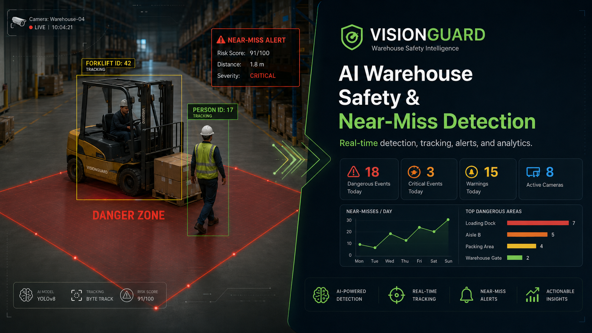
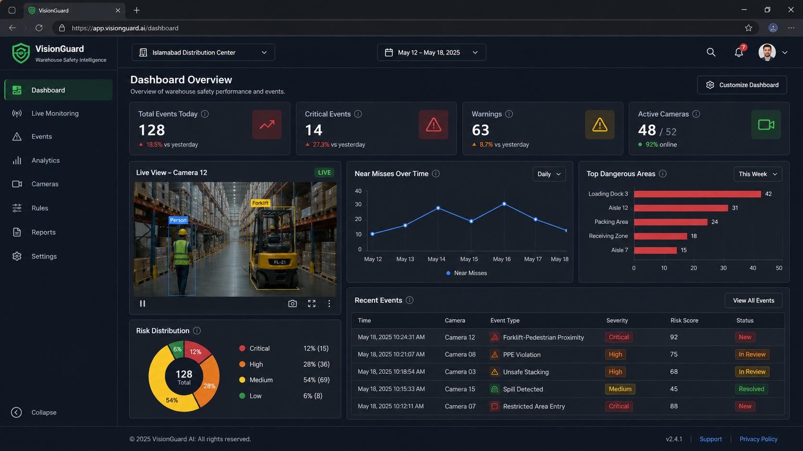
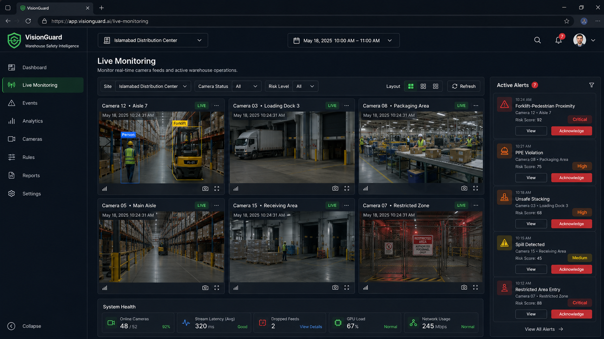
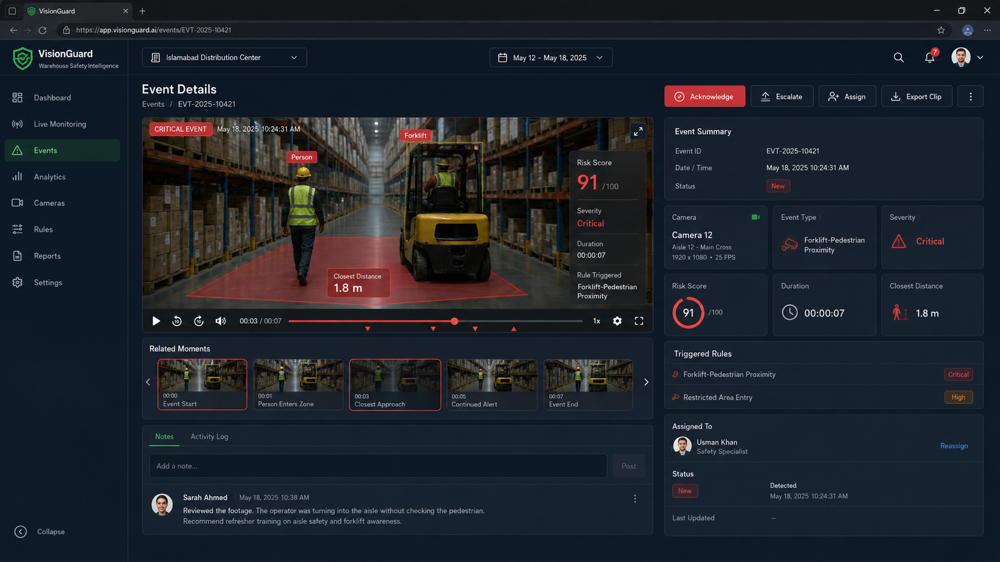
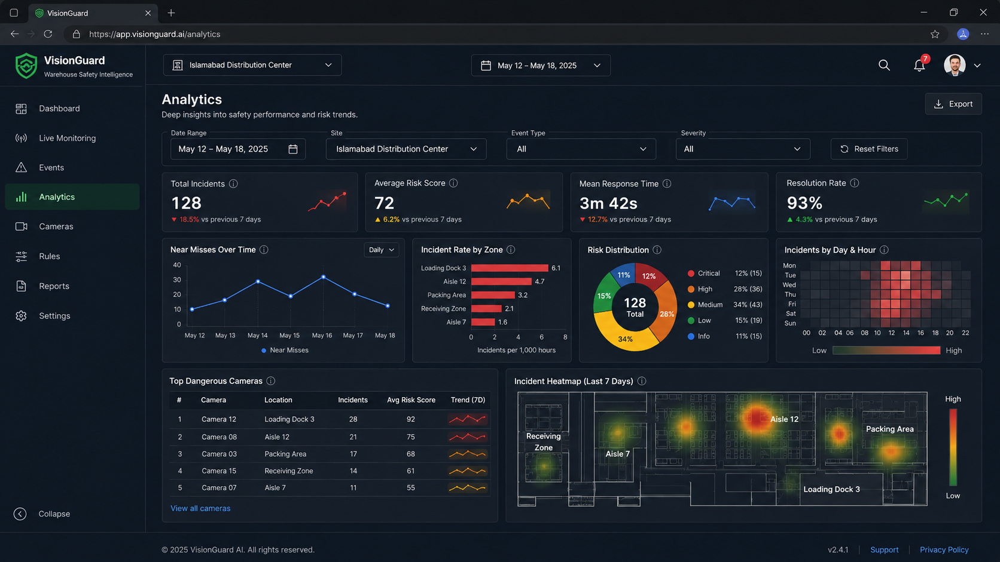
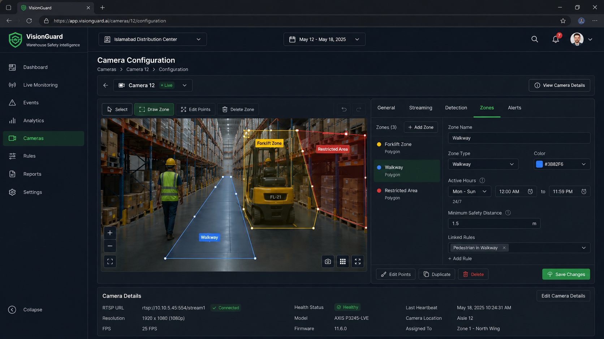
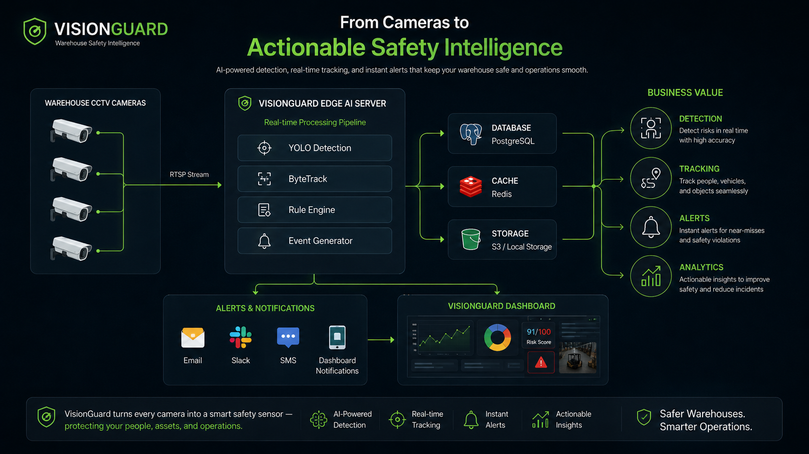
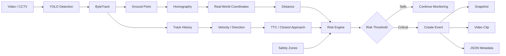
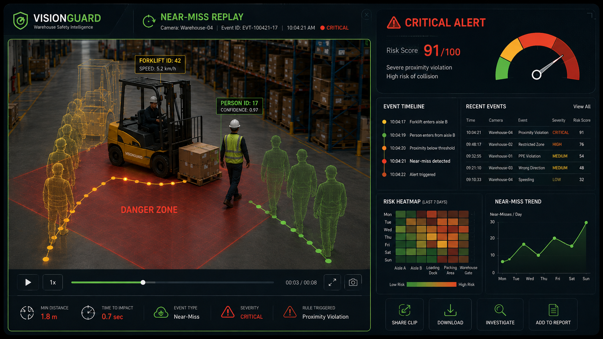

<p align="center">
  
</p>

<h1 align="center">VisionGuard</h1>

<p align="center">
  <strong>AI-powered warehouse safety intelligence for detecting, tracking, analyzing, and explaining forklift–pedestrian risk.</strong>
</p>

<p align="center">
  
  
  
  
  
  
  
</p>

<p align="center">
  <a href="#-product-preview">Preview</a> •
  <a href="#-what-makes-it-different">Why VisionGuard</a> •
  <a href="#-core-pipeline">Pipeline</a> •
  <a href="#-quick-start">Quick Start</a> •
  <a href="#-project-structure">Structure</a> •
  <a href="#-roadmap">Roadmap</a>
</p>

---

## ✦ One-line idea

> **VisionGuard transforms ordinary warehouse video into explainable safety events by combining detection, tracking, spatial context, motion analysis, real-world distance estimation, TTC, and risk scoring.**

Most YOLO demos stop here:

```text
IMAGE → DETECTION → BOUNDING BOX
```

VisionGuard continues:

```text
DETECTION
   ↓
TRACKING
   ↓
REAL-WORLD POSITION
   ↓
SAFETY ZONES
   ↓
TRAJECTORY + SPEED
   ↓
TTC / CLOSEST APPROACH
   ↓
EXPLAINABLE RISK SCORE
   ↓
EVENT EVIDENCE
```

---

# ✨ Product Preview

> [!NOTE]
> The screens below represent the intended product experience around the working computer-vision prototype. The repository can be built progressively from the core CV pipeline toward the full software platform.

## Dashboard

<p align="center">
  
</p>

Monitor active cameras, safety events, risk distribution, near-miss trends, and dangerous warehouse areas from one place.

---

<table>
<tr>
<td width="50%" valign="top">

### Live Monitoring



Real-time multi-camera view with object tracking, risk state, camera health, and active alerts.

</td>

<td width="50%" valign="top">

### Event Investigation



Review the full event context: video, closest distance, TTC, severity, triggered rules, and notes.

</td>
</tr>

<tr>
<td width="50%" valign="top">

### Analytics



Understand incident trends, hotspots, dangerous cameras, and warehouse risk distribution.

</td>

<td width="50%" valign="top">

### Safety-Zone Configuration



Define virtual walkways, forklift zones, restricted areas, and per-camera safety thresholds.

</td>
</tr>
</table>

---

# 🧠 What Makes It Different

<table>
<tr>
<td width="25%" align="center">
<h3>01</h3>
<b>Beyond YOLO</b><br/>
Detection is only the first step.
</td>

<td width="25%" align="center">
<h3>02</h3>
<b>Real Context</b><br/>
Zones, distance, trajectory, speed and exposure duration.
</td>

<td width="25%" align="center">
<h3>03</h3>
<b>Predictive Risk</b><br/>
TTC and closest-approach reasoning instead of distance alone.
</td>

<td width="25%" align="center">
<h3>04</h3>
<b>Explainable Evidence</b><br/>
Every critical event can produce a clip, snapshot and JSON explanation.
</td>
</tr>
</table>

---

# 🏗 Core Pipeline

<p align="center">
  
</p>



---

# 🔥 Advanced Prototype Features

## 1. Virtual Safety Zones

Define polygon regions directly on the camera image:

```text
Pedestrian Walkway
Forklift Lane
Restricted Area
Loading Dock Danger Zone
```

The system checks whether a person and forklift share a relevant zone before increasing risk.

---

## 2. Real-World Distance Estimation

Instead of:

```text
Distance = 182 pixels
```

VisionGuard can estimate:

```text
Distance = 1.82 meters
```

using camera calibration and a ground-plane homography.

```text
Image Pixel Position
        ↓
Homography
        ↓
Ground Coordinate
        ↓
Distance in meters
```

> [!WARNING]
> The provided calibration values are examples. Real deployment requires measured reference points from the actual camera scene.

---

## 3. Trajectory & Speed

Each tracked object keeps a short movement history:

```text
Frame 1    ●
Frame 2       ●
Frame 3          ●
Frame 4             ●
```

From this history VisionGuard estimates:

- velocity vector
- speed
- direction
- closing speed between a person and forklift

---

## 4. TTC / Closest-Approach Prediction

The system can ask:

> **If both objects continue moving, will they enter the configured safety radius?**

Example:

```text
Distance             3.4 m
Closing Speed        1.9 m/s
Predicted Closest    0.8 m
TTC                  1.2 s

Severity             CRITICAL
```

The current implementation uses a **constant-velocity closest-approach heuristic**.

---

## 5. Explainable Risk Scoring

A critical event is not based on a single threshold.

```text
Distance
   +
TTC
   +
Closing Speed
   +
Shared Danger Zone
   +
Exposure Duration
   +
Detection Confidence
   ↓
Risk Score 0–100
```

Example:

```text
Person ID            17
Forklift ID          42
Distance             1.82 m
Closing Speed        1.36 m/s
Shared Zone          YES
TTC                  0.91 s
Exposure             2.4 s

Risk Score           91 / 100
Severity             CRITICAL
```

---

## 6. Automatic Event Evidence

A critical event can automatically create:

```text
output/events/
└── EVT-20260825-121301-842/
    ├── event.mp4
    ├── snapshot.jpg
    └── event.json
```

The recorder keeps a rolling buffer so the saved clip can include:

```text
5 sec BEFORE
     +
critical event
     +
5 sec AFTER
```

---

# 🎬 Explainable Near-Miss Replay

<p align="center">
  
</p>

A useful safety system should explain **why** an alert occurred.

The replay can expose:

- person / forklift track IDs
- object trajectories
- minimum separation
- TTC
- risk score
- event timeline
- triggered rule
- event metadata

---

# 🧾 Example Event JSON

```json
{
  "event_id": "EVT-20260825-121301-842",
  "event_type": "forklift_pedestrian_proximity",
  "person_id": 17,
  "forklift_id": 42,
  "closest_distance_m": 1.82,
  "closing_speed_mps": 1.36,
  "ttc_s": 0.91,
  "shared_zones": [
    "Forklift Danger Zone"
  ],
  "exposure_duration_s": 2.4,
  "risk_score": 91,
  "severity": "critical",
  "reasons": [
    "distance below 2 meters",
    "person and forklift share a danger zone",
    "person and forklift are moving toward each other",
    "predicted collision risk below 2 seconds"
  ]
}
```

---

# 📁 Project Structure

```text
visionguard/
│
├── app.py
├── requirements.txt
├── .gitignore
│
├── vision/
│   ├── __init__.py
│   ├── detector.py
│   ├── zones.py
│   ├── calibration.py
│   ├── motion.py
│   ├── ttc.py
│   ├── risk.py
│   ├── events.py
│   └── drawing.py
│
├── config/
│   ├── zones.json
│   └── calibration.json
│
├── tools/
│   ├── check_model.py
│   ├── zone_picker.py
│   └── calibration_picker.py
│
├── models/
│   └── best.pt
│
├── videos/
│   └── demo.mp4
│
├── output/
│   └── events/
│
└── docs/
    └── images/
```

---

# 🧩 Module Responsibilities

| Module | Responsibility |
|---|---|
| `detector.py` | YOLO detection + ByteTrack |
| `zones.py` | Virtual polygon safety zones |
| `calibration.py` | Pixel → ground-plane coordinate conversion |
| `motion.py` | Track history, velocity, speed, closing speed |
| `ttc.py` | Closest-approach / TTC heuristic |
| `risk.py` | Explainable risk score |
| `events.py` | Pre/post event recording and metadata |
| `drawing.py` | Bounding boxes, risk panels, distance overlays |
| `check_model.py` | Verify required model classes |
| `zone_picker.py` | Click points to create a safety-zone polygon |
| `calibration_picker.py` | Select camera calibration reference points |

---

# ⚡ Quick Start

## 1. Clone

```bash
git clone https://github.com/YOUR_USERNAME/visionguard.git
cd visionguard
```

## 2. Create a virtual environment

```bash
python -m venv .venv
```

### Windows

```bash
.venv\Scripts\activate
```

### Linux / macOS

```bash
source .venv/bin/activate
```

## 3. Install dependencies

```bash
pip install -r requirements.txt
```

```text
ultralytics
opencv-python
numpy
```

---

# 🎯 Prepare the Model

Place your custom model at:

```text
models/best.pt
```

The default logic expects:

```text
person
forklift
```

Check the model:

```bash
python tools/check_model.py
```

Expected:

```text
VisionGuard check:

✓ person
✓ forklift
```

> [!TIP]
> Standard COCO pretrained models contain `person`, but do not provide a dedicated `forklift` class. A custom model is recommended for this project.

---

# 🗺 Configure a Safety Zone

Run:

```bash
python tools/zone_picker.py
```

Controls:

```text
Left Click    Add point
R             Reset
S             Save
Q             Quit
```

The tool generates:

```text
config/zones.json
```

---

# 📐 Configure Ground Calibration

Run:

```bash
python tools/calibration_picker.py
```

Choose at least four visible floor points whose real-world positions are known.

Then update:

```text
config/calibration.json
```

Example:

```json
{
  "image_points_px": [
    [450, 520],
    [1450, 520],
    [1700, 1000],
    [250, 1000]
  ],
  "ground_points_m": [
    [0.0, 8.0],
    [8.0, 8.0],
    [8.0, 0.0],
    [0.0, 0.0]
  ]
}
```

---

# ▶ Run VisionGuard

Add your test video:

```text
videos/demo.mp4
```

Then:

```bash
python app.py
```

Or:

```bash
python app.py \
  --model models/best.pt \
  --video videos/demo.mp4 \
  --zones config/zones.json \
  --calibration config/calibration.json
```

Press:

```text
Q
```

to stop.

---

# 📊 Risk Model

Current prototype weighting:

| Signal | Weight |
|---|---:|
| Distance | 30% |
| TTC | 25% |
| Closing Speed | 15% |
| Shared Danger Zone | 15% |
| Exposure Duration | 10% |
| Detection Confidence | 5% |

Severity:

```text
0–34     LOW
35–59    MEDIUM
60–79    HIGH
80–100   CRITICAL
```

The weights are deliberately visible and configurable so the system remains explainable.

---

# 🚦 Example Decision Flow

```text
Person #17 detected
        +
Forklift #42 detected
        ↓
Both tracked successfully
        ↓
Ground coordinates estimated
        ↓
Distance = 1.82 m
        ↓
Both inside danger zone
        ↓
Closing speed = 1.36 m/s
        ↓
TTC = 0.91 s
        ↓
Risk = 91 / 100
        ↓
CRITICAL EVENT
        ↓
Save snapshot + clip + JSON
```

---

# 🗺 Roadmap

<details open>
<summary><b>Phase 1 — Computer Vision Core</b></summary>

- [x] YOLO integration
- [x] ByteTrack integration
- [x] Person / forklift filtering
- [x] Persistent track IDs
- [x] Bounding-box overlays
- [x] Video processing

</details>

<details open>
<summary><b>Phase 2 — Safety Intelligence</b></summary>

- [x] Virtual safety zones
- [x] Ground-plane calibration
- [x] Real-world distance estimation
- [x] Track-history based velocity
- [x] Closing-speed estimation
- [x] TTC / closest-approach heuristic
- [x] Explainable risk scoring
- [x] Exposure-duration logic

</details>

<details open>
<summary><b>Phase 3 — Evidence</b></summary>

- [x] Rolling frame buffer
- [x] Pre-event recording
- [x] Post-event recording
- [x] Event snapshot
- [x] JSON metadata
- [x] Basic event cooldown

</details>

<details>
<summary><b>Phase 4 — Next Advanced Features</b></summary>

- [ ] Dynamic forklift safety envelope
- [ ] Stopping-distance estimation
- [ ] Forklift speed-limit rules
- [ ] Wrong-direction detection
- [ ] Risk heatmap
- [ ] Risk-normalized heatmap
- [ ] PPE compliance module
- [ ] Privacy / person anonymization
- [ ] Camera health monitoring
- [ ] False-positive feedback
- [ ] Active-learning workflow

</details>

<details>
<summary><b>Phase 5 — Product Platform</b></summary>

- [ ] Streamlit prototype dashboard
- [ ] Event browser
- [ ] Event replay
- [ ] Camera configuration
- [ ] Interactive safety-zone editor
- [ ] Analytics dashboard
- [ ] RTSP camera support
- [ ] Multi-camera processing

</details>

<details>
<summary><b>Future Production Direction</b></summary>

- [ ] FastAPI backend
- [ ] PostgreSQL
- [ ] Redis / event messaging
- [ ] WebSocket alerts
- [ ] Authentication
- [ ] Role-based access control
- [ ] ONNX export
- [ ] TensorRT inference
- [ ] Docker
- [ ] GPU monitoring
- [ ] Stream health monitoring
- [ ] Model monitoring

</details>

---

# 💡 Why This Is More Than a YOLO Demo

<table>
<tr>
<th>Typical YOLO Demo</th>
<th>VisionGuard</th>
</tr>
<tr>
<td>Detect object</td>
<td>Detect + track object</td>
</tr>
<tr>
<td>Bounding box</td>
<td>Ground position</td>
</tr>
<tr>
<td>Pixel distance</td>
<td>Real-world distance</td>
</tr>
<tr>
<td>Current frame only</td>
<td>Movement history</td>
</tr>
<tr>
<td>Static threshold</td>
<td>Multi-signal risk model</td>
</tr>
<tr>
<td>Alert text</td>
<td>Explainable event</td>
</tr>
<tr>
<td>No evidence</td>
<td>Clip + snapshot + metadata</td>
</tr>
</table>

---

# 🧰 Technology Stack

<p align="center">

| Layer | Current / Planned |
|---|---|
| Detection | Ultralytics YOLO |
| Tracking | ByteTrack |
| Video | OpenCV |
| Math / Geometry | NumPy |
| Calibration | OpenCV Homography |
| Prototype UI | Streamlit |
| API Direction | FastAPI |
| Database Direction | PostgreSQL |
| Optimization | ONNX / TensorRT |
| Deployment | Docker |

</p>

---

# 🧭 Project Philosophy

> **A detection is not an incident. An incident requires context.**

That context comes from:

```text
tracking
+ geometry
+ motion
+ rules
+ time
+ evidence
```

VisionGuard is designed around that principle.

---

# ⚠️ Safety Disclaimer

VisionGuard is an **educational and research prototype**.

It is not a certified occupational-safety system and should not be used as the sole mechanism for preventing workplace injury or collision.

A real-world deployment would require:

- calibrated cameras
- site-specific validation
- safety-engineering review
- model evaluation
- false-positive / false-negative analysis
- privacy and retention controls
- fail-safe procedures
- health monitoring
- appropriate human oversight

---

# 🤝 Contributing

Contributions, experiments, issues, ideas, and improvements are welcome.

If you find VisionGuard useful, consider giving the repository a ⭐.

---

<p align="center">
  <strong>VisionGuard</strong><br/>
  <sub>Computer Vision → Context → Prediction → Safety Intelligence</sub>
</p>
